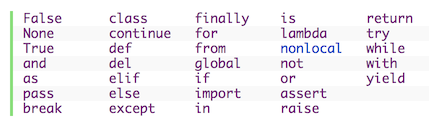
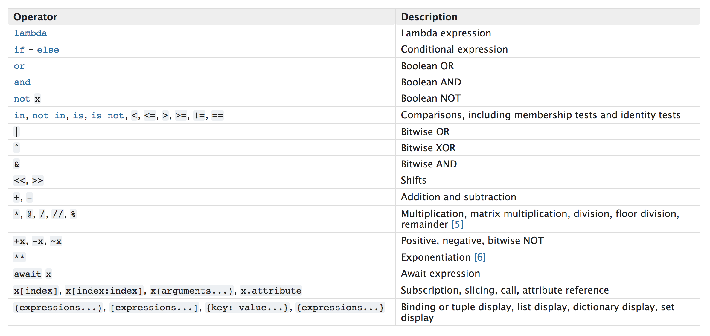

# #100DaysOfCode Log - Round 1 - Python

Started on: Wednesday, October 4, 2017

## Resources

- [100 Days Of Python](http://tecladocode.com/blog/100daysofpython/)
- [#100DaysOfPython](https://twitter.com/search?q=%23100DaysOfPython)
- [Link To Work](https://github.com/juancarlosqr/datascience/tree/master/python/100daysofpython)

## Log

### R1D0
kicking off this!

### R1D1
python setup and filtering learning resources
- [How to Setup Anaconda on Mac OSX](http://mrshipley.com/2016/09/19/how-to-setup-anaconda-on-mac-osx/)
- [Day 1: How to get started with Python](http://tecladocode.com/blog/learn-python-day-1-how-to-start-with-python/)
- [Introduction to Computer Science and Programming Using Python](https://www.edx.org/course/introduction-computer-science-mitx-6-00-1x-11)
- [Introduction to Python](https://www.udacity.com/course/introduction-to-python--ud1110)
- [Introduction To Python Programming](https://www.udemy.com/pythonforbeginnersintro/)
- [A Byte of Python](https://python.swaroopch.com/)
- [The Python Guru](http://thepythonguru.com/)
- [Dive Into Python 3](http://www.diveintopython3.net/)
- [Data Rebellion Python Resources](https://datarebellion.com/resources/)

### R1D2
refreshing basics like variables, string slicing and placeholders. also started udemy course
- [Day 2: What is programming all about?](http://tecladocode.com/blog/learn-python-day-2-what-is-programming-about/)

### R1D3
more on string formatting with .format and the new "f-string" syntax (python 3.6). I like this f-string syntax
- [Day 3: Key Python Building Blocks](http://tecladocode.com/blog/learn-python-day-3-first-look-at-python/)
- [Basics](https://python.swaroopch.com/basics.html)
- [The new f-strings in Python 3.6](https://cito.github.io/blog/f-strings/)

### R1D4
datatypes, numbers, operators and comparing, searching, testing and converting strings

- [Getting started with python](http://thepythonguru.com/getting-started-with-python/)
- [Datatype & Variables](http://thepythonguru.com/datatype-varibles/)
- [Python Numbers](http://thepythonguru.com/python-numbers/)
- [Python Strings](http://thepythonguru.com/python-strings/)

### R1D5
intro to functions and imports

- [What's New In "Dive Into Python 3"](http://www.diveintopython3.net/whats-new.html)
- [Chapter 1. Your First Python Program](http://www.diveintopython3.net/your-first-python-program.html)

### R1D6
operators, expressions, control flow and loops

- [Operators and Expressions](https://python.swaroopch.com/op_exp.html)
- [Control Flow](https://python.swaroopch.com/control_flow.html)
- [Day 5: Booleans and if statements in Python](http://tecladocode.com/blog/learn-python-day-5-booleans-if-statements/)
- [Day 6: For and While Loops in Python](http://tecladocode.com/blog/learn-python-day-6-for-and-while-loops-in-python/)

## Notes

- Everything in Python is an object
- Everything is Case-Sensitive
- Variables
  - Python does not support in-line assignment, so there's no chance of accidentally assigning the value you thought you were comparing ```if version = 2```
- Operators
  - Operators with the same precedence are evaluated in a left to right manner (```5 + 9 - 4```)
- Control Flow
  - There is no ```switch``` statement in Python. You can use an ```if..elif..else``` statement to do the same thing (and in some cases, use a [dictionary](https://python.swaroopch.com/data_structures.html#dictionary) to do it quickly)
  - ```while``` and ```for``` statements can have an optional ```else``` clause
  - If there is an ```else``` clause for a ```while``` or ```for``` loop, it is always executed unless you break out of the loop with a ```break``` statement
- Functions
  - As soon as you have a named argument, all arguments to the right of that need to be named arguments, too
- Exceptions
  - Some programming languages encourage the use of error return codes, which you check. Python encourages the use of exceptions, which you handle
- Modules
  - A module's ```__name__``` depends on how you're using the module. If you import the module, then ```__name__``` is the module's filename, otherwise will be a special default value, ```__main__```

__Keywords in Python 3__



__Operators__


__Operators Precedence__

[Source](https://docs.python.org/3/reference/expressions.html#operator-precedence)



__Augmented Assignment Operators__


